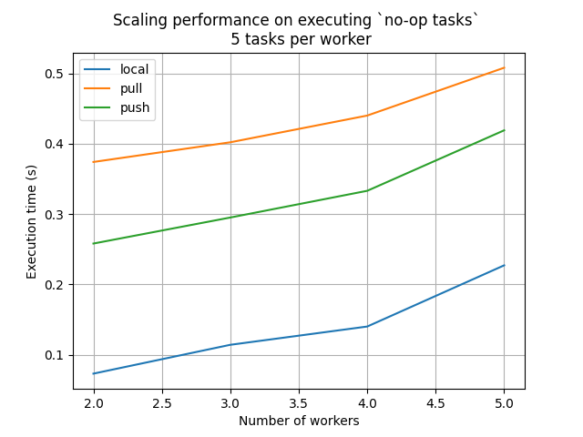
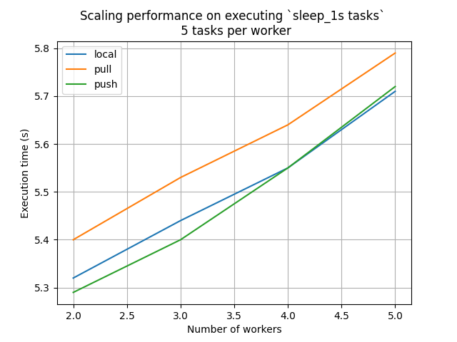
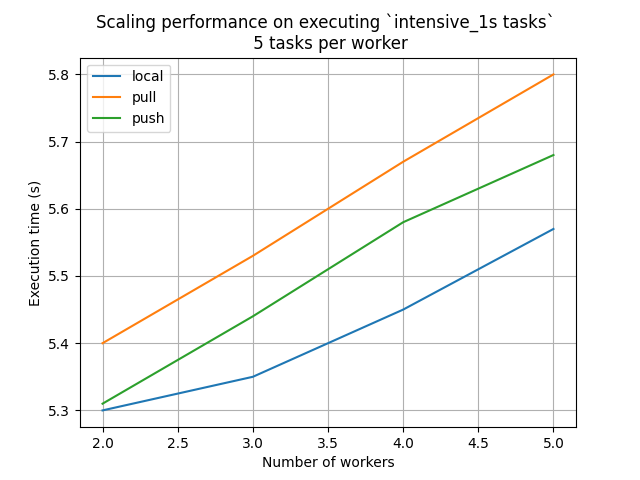

# Technical Report

## Outline

### - Introduction

### - Experimental Setup

### - Performance Metrics

### - Experimental Scenarios

### - Experimental Procedure

### - Results and Analysis

### - Conclusion

### - Future Work

## 1. Introduction

The purpose of this experiment is to assess the performance of the Faas (Function-as-a-Service) platform. The evaluation will focus on key dimensions such as latency and throughput. To achieve this, various types of functions will be executed, including "no-op" tasks that return immediately, "sleep" tasks that sleep for a defined period of time and also "intensive" tasks that actually compete for CPU resources

## 2. Experimental Setup

- Faas Platform: We use our self-implementing Faas platform. See the requirements.txt file for the required packages and modules
- Hardware Infrastructure:
    - Operating System: `Microsoft Windows 10`
    - System SKU: `LENOVO_MT_82GH_BU_idea_FM_XiaoXinPro 14ITL 2021`
    - Processor: `11th Gen Intel(R) Core(TM) i5-1135G7 @ 2.40GHz, 2419 MHz, 4 cores, 8 logical processors.`
    - RAM: `16GB`
- Software Stack: Python, FastAPI, redis, ZMQ

## 3. Performance Metrics

 - Latency: Measure the time taken by the Faas platform to execute functions and respond to requests. Key metrics to consider include:
    - Function execution time: Time taken from invoking a function to receiving a response.
    - Cold start latency: Time taken for a function to start executing when it is invoked for the first time. 
    - Warm start latency: Time taken for a function to start executing when it is invoked subsequently.
    
 - Throughput: Evaluate the ability of the Faas platform to handle a high volume of function invocations. Metrics to consider include:
    - Requests per second (RPS): The number of function invocations the platform can handle per second.
    - Concurrency: Measure the number of simultaneous function executions the platform can support without significant performance degradation.
    
 - Some heads up:
    - For this experiment, we choose to measure the Function execution time under several scenarios to represent the latency and throughput ability. 
    - We implemented a weak scaling study, which increases the amount of work as the number of processes increases
    
## 4. Experimental Scenarios

 - `No-op Tasks`: Run functions that perform minimal computation and return immediately. These tasks help evaluate the baseline performance of the platform by minimizing the impact of actual computation.
 - `Sleep" Tasks`: Execute functions that sleep for a defined period of time. This scenario simulates functions that have longer execution times and assesses the platform's ability to handle such delays.
 - `Intensive Tasks`: This type of tasks simulates the real workload of the Faas Platform when it is actually put into use. These tasks are intensive which mean they compete for CPU resources unlike sleep tasks.

## 5. Experimental Procedure

 - Define the workload: Specify the number and type of tasks to be executed.
 - Faas Platform Setup: setup the dispatcher and its corresponding workers according to the weak scaling principle
 - Execute the workload: Execute the test_performance_client.py to run the workload on the Faas platform while collecting performance data.
 - Repeat the experiments: Conduct multiple runs to ensure statistical significance and identify any variations.

## 6. Results and Analysis:

 - With the number of tasks increase (5 tasks per worker), the overall execution time doesn't increase too much, which is great. It means the Faas platform has good scalability.
 - The results are in line with expectations, and the time spending in pull mode is generally longer than that of push. This is because there are more overheads. At the same time, the workload of each worker in pull mode is not necessarily balanced, while there is a load balancer in the push mode.
 - It seems that the local mode's performance is the best. But this just because the experiment is conducted on a single laptop. In a real distributed system, it is expected that the push mode would have the best performance.

